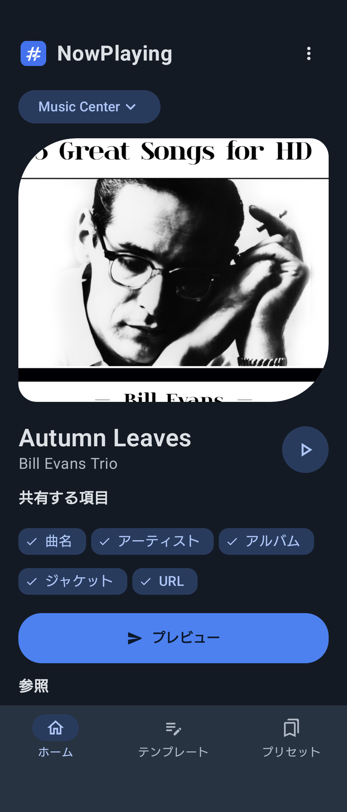
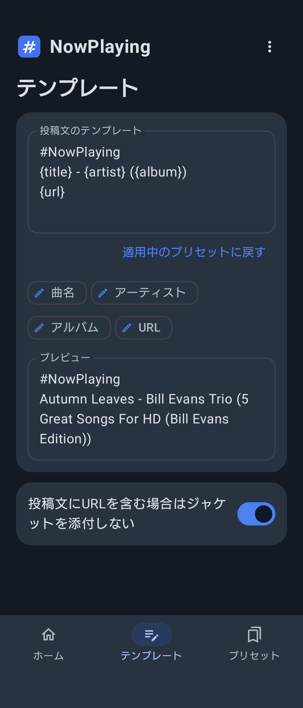
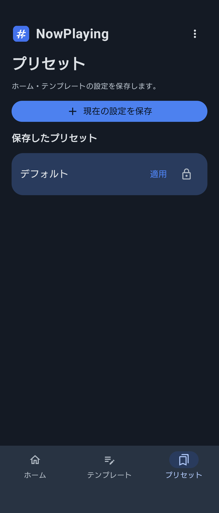
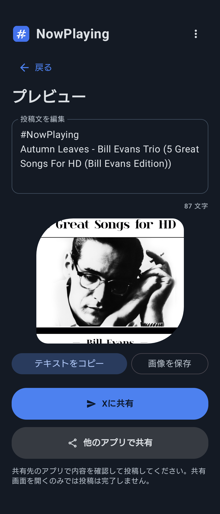
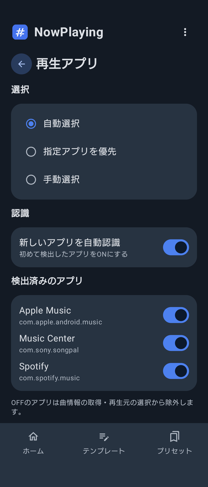

# NowPlaying

再生中の音楽情報を取得し、好みの投稿文でXやほかのアプリへ共有できるAndroidアプリです。

> 現在はβ版です。不具合や予期しない動作が含まれる可能性があります。

## ダウンロード

最新版は以下のページからダウンロードできます。

[NowPlaying Releases](https://github.com/mqhiru1110/NowPlaying/releases)

Releaseページの「Assets」にある `.apk` ファイルを選択してください。

「Source code (zip)」「Source code (tar.gz)」はインストール用ファイルではありません。

## スクリーンショット

<table>
  <tr>
    <td align="center">
       
      ホーム
    </td>
    <td align="center">
       
      テンプレート
    </td>
 </td>
    <td align="center">
       
      プリセット
    </td>
  </tr>
  </tr>
  <tr>
    <td align="center">
       
      プレビュー
    </td>
    <td align="center">
       
      設定
    </td>
  </tr>
</table>

## 主な機能

- 再生中の曲名、アーティスト、アルバム、ジャケットを取得
- SpotifyとApple Musicの曲URLを生成
- 共有する項目を個別に選択
- 項目ごとに参照元と優先順位を設定
- 投稿文のテンプレートを編集
- 複数のプリセットを保存
- 投稿前のプレビューと一時編集
- Xまたはほかのアプリへ共有
- テキストのコピーとジャケット画像の保存

## 動作環境

- Android 8.0以上
- 通知へのアクセスが必要
- 対応状況はアプリケーションによって異なります

## インストール方法

1. [Releases](https://github.com/mqhiru1110/NowPlaying/releases)を開きます。
2. 最新のReleaseにあるAPKをダウンロードします。
3. ダウンロードしたAPKを開きます。
4. 必要に応じて、ブラウザまたはファイルアプリに「不明なアプリのインストール」を許可します。
5. NowPlayingをインストールします。

デバッグ版をインストールしている場合は、署名が異なるため上書きできません。デバッグ版をアンインストールしてから、改めてリリース版をインストールしてください。

## 通知へのアクセス

NowPlayingは、音楽アプリが公開する再生情報を取得するために通知へのアクセスを使用します。

通知へのアクセスを許可できない場合は、端末の設定からNowPlayingのアプリ情報を開き、右上の「︙」メニューから「制限付き設定を許可」を選択してください。

その後、再度アプリに戻り、通知へのアクセスを設定してください。

## プライバシー

- 取得した通知情報や曲情報は端末内で処理します。
- 取得した情報をNowPlayingから外部サーバーへ送信する機能はありません。
- 共有操作を行った場合は、選択した文章や画像が共有先のアプリへ渡されます。
- 共有画面を開いただけでは投稿は完了しません。共有先のアプリで内容を確認してから投稿してください。

## β版について

現在のバージョンはβ版です。

端末や音楽アプリによって、取得できる項目や共有結果が異なる場合があります。不具合を見つけた場合は、GitHubのIssuesから報告してください。

[不具合を報告する](https://github.com/mqhiru1110/NowPlaying/issues)

## 免責事項

本アプリはSpotify、Apple、Google、YouTube、Xの公式アプリではありません。各サービス名および商標は、それぞれの所有者に帰属します。
